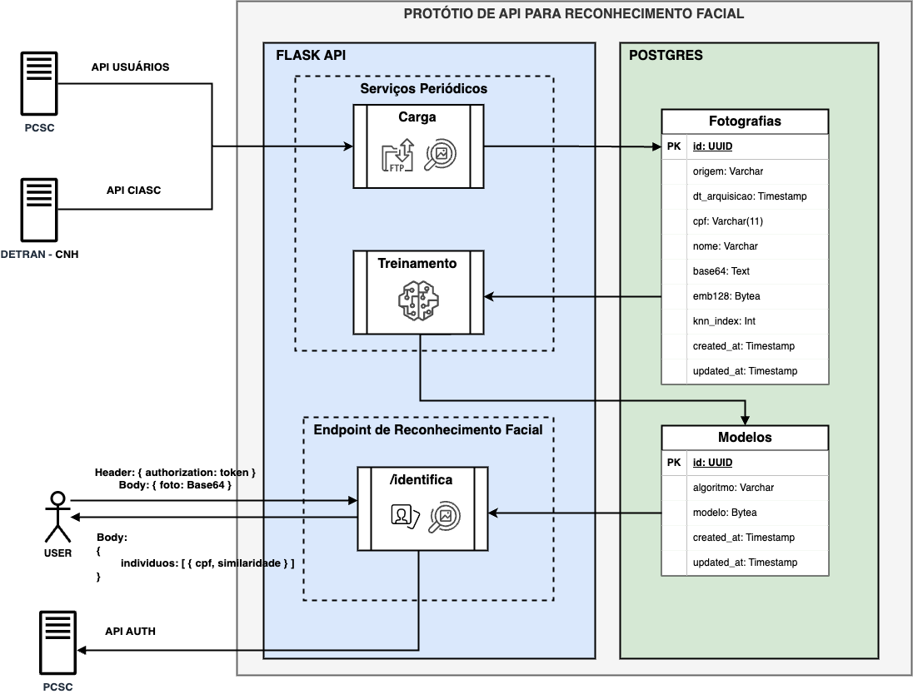

>UNIVERSIDADE COMUNITÁRIA DA REGIÃO DE CHAPECÓ \
ÁREA DE CIÊNCIAS EXATAS E AMBIENTAIS \
CURSO DE CIÊNCIA DA COMPUTAÇÃO - 2023/2 \
(BACHARELADO)

### PROTÓTIPO DE API DE RECONHECIMENTO FACIAL COM MODELO DE MACHINE LEARNING PARA A POLÍCIA CIVIL DE SANTA CATARINA

>*Aluno:* Rafael Rath\
>*Orientador:* Prof. Marcos Antonio Moretto, MSc.

### Descrição
Projeto de criação da API de reconhecimento facial para a Polícia Civil de Santa Catarina.

Esta API em sua versão 1 faz o reconhecimento facial através de modelo de Machine Learning KNN treinado com a base de vetores de rostos cadastrados no PostgreSQL.

Para carga do banco de dados há um serviço que realiza os seguintes passos:
1. Busca uma lista de pessoas (nome e CPF) na API de usuários dos sitemas da Polícia Civil;
2. Requisição de imagem de cada pessoa na API do DETRAN/CIASC;
3. Realiza a extração dos embeddings (vetores) de cada foto e armazenamento no banco de dados juntamente com os dados da pessoa.

Para o treinamento do modelo, o serviço realiza os seguintes passos:
1. Verifica no Banco de Dados quantas fotos foram cadastradas e ainda não processadas.
2. Caso existam mais de 100, o serviço realiza a busca de todos os embeddings cadastrados (antigos e novos), e treina o modelo KNN.
3. Após o treinamento, o modelo é salvo no Banco de Dados em formato binário para ser utilizado para o reconhecimento facial.

Para reconhecimento facial a API recebe uma imagem em Base64 e realiza os seguintes passos:
1. Validada o token,
2. Valida os parâmetros presentes no corpo da requisição,
3. Realiza uma busca de rostos na imagem para verificar se há algum (máximo: 01).
4. Extrai os embeddings do rosto encontrado e realiza o reconhecimento com o algoritmo de Machine Learning KNN utilizando o último modelo treinado.
5. Retorna a lista de pessoas semelhantes para o rosto encontrado na foto.

**Stack da aplicação:** Python3 | Flask | ORM Flask-SQLAlchemy | PostgreSQL
